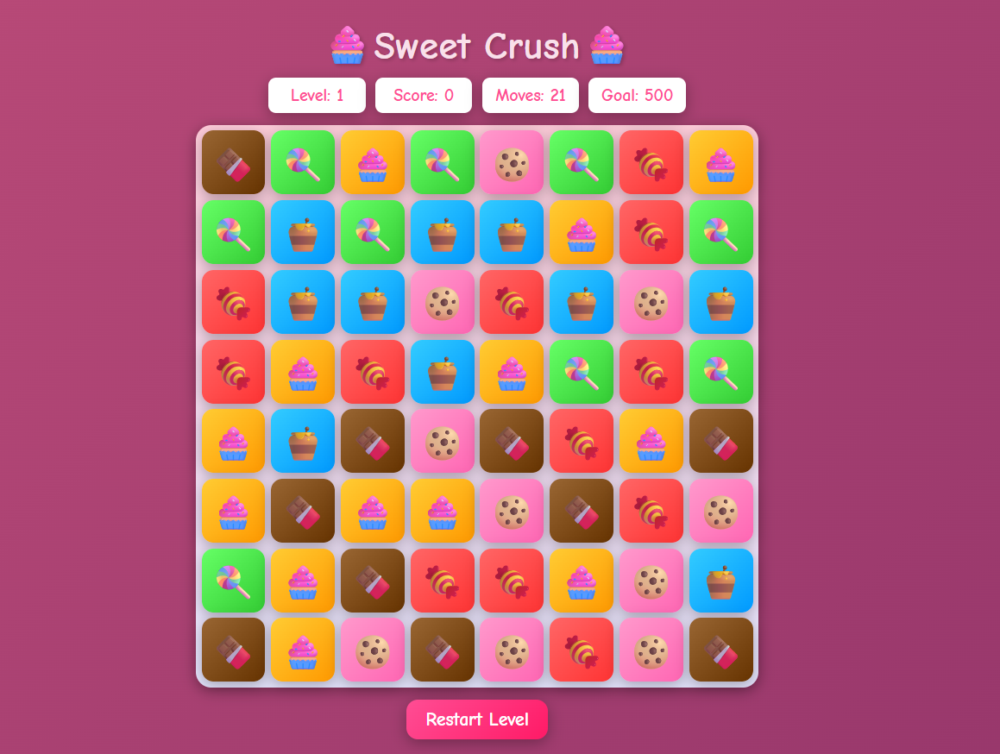

### Fruit Crush 🍬
A vibrant match-3 puzzle game inspired by Candy Crush, built with HTML, CSS, and JavaScript. Swap colorful candies to make rows or columns of 3 or more and score points!

## 🎮 Features

- Grid-based match-3 gameplay with falling candies 🍬🍭🧁
- Swap adjacent tiles to create matches of 3 or more
- Cascading matches with smooth animations
- Level-based progression with increasing goals 
- Dynamic move limit that increases with levels 
- Special candies:

1- Color Bomb (🌟): Clears all candies of a type or the entire board with a rainbow glow

2- Striped Candy (➡️/⬇️): Horizontal match of 4 creates a vertical striped candy (⬇️) that clears a column; vertical match of 4 creates a horizontal striped candy (➡️) that clears a row

3- Wrapped Candy (🎁): Clears a 3x3 area with a sparkling wrapper

- Sound effects for matches, special candy activations, level completion, and game over
- Colorful design with vibrant candy visuals, gradients, and animations
- Responsive layout for desktop and mobile

## 🛠️ Tech Stack

- HTML5 – structure
- CSS3 – colorful styling and animations
- JavaScript (ES6) – game logic

## 🚀 Getting Started

- Clone the repo
```
git clone https://github.com/Hamna902/Sweet-Crush-Game.git
cd sweet-crush-game
```
- Run locally
- Open index.html in your browser (double-click or drag into Chrome/Firefox). No server setup required!
- Ensure the sounds/ folder with sound files (match.mp3, striped.mp3, wrapped.mp3, colorbomb.mp3, win.mp3, lose.mp3) is in the project directory for audio to work.


## 📂 Project Structure
```
fruit-crush/
│── index.html     # Main HTML file
│── styles.css     # Stylesheet with candy-themed design
│── main.js        # Game logic
│── sounds/        # Folder containing sound effect files
│   ├── match.mp3
│   ├── striped.mp3
│   ├── wrapped.mp3
│   ├── colorbomb.mp3
│   ├── win.mp3
│   ├── lose.mp3
└── README.md      # Project documentation
```

## 🎯 How to Play

- Click a candy 🍬, then an adjacent candy to swap them.
- If the swap creates a row or column of 3 or more identical candies, they disappear with animations and sound effects.
- New candies fall smoothly to fill the board.
- Earn points per match (10 points per candy).
- Special candies:

1- Match 4 candies horizontally to create a vertical striped candy (⬇️) that clears a column when activated.

2- Match 4 candies vertically to create a horizontal striped candy (➡️) that clears a row when activated.

3- Match 5 candies to create a color bomb (🌟) or a wrapped candy (🎁) for larger effects.

- Win a level by reaching the goal score within the move limit.
- After winning, press "OK" to start the next level with a higher goal and more moves.
- Sound effects enhance the experience: matches, special candy activations, level wins, and losses.

## 🌟 Future Improvements

- Add background music and particle effects.
- Implement timed levels ⏱️.
- Enhance mobile touch controls with swipe gestures.
- Add more special candy combinations and effects.

## 📸 Preview

  


## 📜 Author
HAMNA NAZAR

